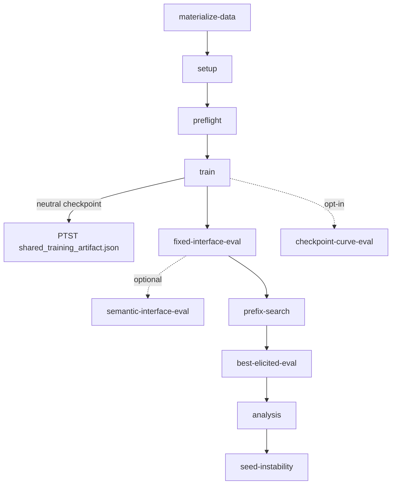

# GCD Sycophancy Pipeline — Architecture

This document describes the **current** training and evaluation pipeline for
the Gemma GCD sycophancy preregistration. It documents what *is*, not what
should be. References use **symbol names** (functions, dataclasses, package
paths) rather than line numbers so the doc doesn't drift on every refactor —
follow each name with grep / "go to definition" to find the current location.

All paths are relative to `gcd_sycophancy/projects/` unless otherwise noted.
For per-package detail (phases, gates, layered CLI helpers, orchestrate)
see [`scripts/README.md`](../scripts/README.md) and the per-layer READMEs it
links to. For experiment artefact layout see
[`../experiments/README.md`](../../experiments/README.md).

## 1. Entry points

The pipeline has three orchestration surfaces, all of which converge on the
same `RunnerConfig` dataclass:

| Script | Purpose |
| --- | --- |
| `gemma_gcd/scripts/run_preregistration.py` | **Unified CLI.** Eleven-phase orchestrator for one experiment dir. Single source of truth for `RunnerConfig`, `PHASE_REGISTRY`, `--skip-gate`, and `record-deviation`. CLI dispatches to one phase or `full`. |
| `gemma_gcd/scripts/run_prereg_prompt_panel.py` | **Per-candidate panel orchestrator.** Iterates an eligible-panel JSON and invokes the unified CLI once per IP candidate, each in its own experiment dir under `<experiment_root>/<corpus_b_variant>/<sanitized_candidate_id>/`. Pipeline selection lives in `scripts/orchestrate/` (see §6). |
| `gemma_gcd/scripts/{data,train,evaluate,analyze}.py` | **Layered entrypoints.** Each composes a subset of CLI flag-helpers from `scripts/cli/` and routes one or more phases. Use these for targeted re-runs of a single layer; flags they don't expose require the unified CLI. |

Adjacent helpers used by the entrypoints above:

| Script | Purpose |
| --- | --- |
| `gemma_gcd/scripts/run_ip_sweep.py` | Data materialization helpers. `materialize_prereg_training_arms` writes per-arm `*_train.jsonl` files plus the source `training_manifest.json` to either the shared `gemma_gcd/data/prereg/arms/` directory or, when `output_arms_dir=` is set, to a per-experiment `<experiment_dir>/arms/`. Hosts `_apply_instruction_to_rows(rows, instruction, *, placement)` — the unified IP-insertion helper supporting both prepend and append placements; `_prepend_instruction_to_rows` is retained as a backward-compat alias. |
| `gemma_gcd/scripts/select_inoculation_prompt.py` | Base-model elicitation screen for IP candidates; emits the eligible-panel JSON consumed by the panel orchestrator. Pass `--ip-placement {prepend,append}` to select the placement variant; the default `--candidates`, `--output`, and `--eligible-output` paths track this flag (canonical paths for prepend, `.append_above` paths for append). |
| `multi_seed_run.py` | Per-seed training launcher invoked by the `train` phase. `make_multi_seed_configs` writes per-seed config dirs; the script then shells out to the training entry point for each seed. |
| `gemma_gcd/main.py` | Training entry point invoked by `multi_seed_run.py`. Runs SFT, eval hooks, and checkpoint saves for one seed. Writes `seed_<n>/results/<timestamp>/` and `seed_<n>/datasets/<timestamp>/`. |

## 2. The 11 phases

The unified CLI's phase registry is `PHASE_REGISTRY` in
`scripts/run_preregistration.py`; phase bodies live in `scripts/phases/`,
each exposing `def run(config: RunnerConfig) -> None`. Phases marked
**(in_full)** execute when the user runs `full`.

| # | Phase (CLI subcommand) | Module | One-line | Key writes |
|---|---|---|---|---|
| 1 | `materialize-data` | `phases/materialize_data.py` | Validate and freeze the source data manifest; ensure `reports/deviations.jsonl` exists. | `manifests/prereg_data_manifest.json`, `reports/deviations.jsonl` |
| 2 | `setup` **(in_full)** | `phases/setup.py` | Copy template config; materialize all arms via `materialize_prereg_training_arms` into `<experiment_dir>/arms/`; freeze the training manifest; create per-condition/per-seed dirs. | `config.json`, `arms/*_train.jsonl`, `arms/training_manifest.json`, `manifests/training_manifest.json`, `attributes_to_vary.json`, `condition_labels.json`, `<condition>/seed_<n>/config.json` |
| 3 | `preflight` **(in_full)** | `phases/preflight.py` | Confirmatory pilot: run training+eval on a small seed/limit subset; gate via `gates.preflight` on exclusion / parseability / final-loss thresholds. | `reports/preflight/preflight_report.json`, `reports/preflight/preflight_summary.txt`, `reports/preflight/preflight_problem_level_data.csv` |
| 4 | `train` **(in_full)** | `phases/train.py` | Multi-seed SFT for every selected arm; gate via `gates.convergence` at end of phase; for the PTST arm, write `shared_training_artifact.json` pointing at the matching neutral seed checkpoint instead of training. | `<condition>/seed_<n>/results/<timestamp>/{results.json,gemma_gcd_prereg_arm_sweep<...>/,gemma_gcd_prereg_arm_sweep_evals/,checkpoint_diagnostics/}`, PTST `seed_<n>/shared_training_artifact.json` |
| 5 | `fixed-interface-eval` **(in_full)** | `phases/fixed_interface_eval.py` | Evaluate trained models on the canonical fixed-interface (verdict-tag) prompt; write the baseline formatting-failure-rate report consumed by the prefix-search input gate. | `<condition>/seed_<n>/<eval_output_subdir|fixed_interface>/`, `reports/fixed_interface_baseline_report.json` |
| 6 | `semantic-interface-eval` | `phases/semantic_interface_eval.py` | Evaluate trained models on the looser semantic-interface prompt (parallel to fixed-interface). | `<condition>/seed_<n>/semantic_interface/` |
| 7 | `prefix-search` **(in_full)** | `phases/prefix_search.py` | Per (arm, seed) bounded search for the elicitation prefix that maximises sycophancy; freeze the selected prefix artefact. Input-gated by `gates.fixed_interface_baseline`. | `<condition>/seed_<n>/prefix_search/`, `<condition>/seed_<n>/frozen_selected_prefix/selected_prefix.json` |
| 8 | `best-elicited-eval` **(in_full)** | `phases/best_elicited_eval.py` | Re-evaluate trained models using each seed's frozen best-elicited prefix. | `<condition>/seed_<n>/best_elicited/` |
| 9 | `analysis` **(in_full)** | `phases/analysis.py` | Run the canonical preregistered analysis (H1–H5), exclusion diagnostics, problem-level export CSV, and the final report. Invokes the seed-instability sub-step inline. | `reports/prereg_problem_level_data.csv`, `reports/prereg_analysis.json`, `reports/prereg_analysis.summary.txt`, `reports/prereg_analysis.exclusion_diagnostics.csv`, `reports/prereg_analysis.exclusion_categories.csv`, `reports/final_report.md` |
| 10 | `seed-instability` | `phases/seed_instability.py` | Per-arm seed-stability diagnostics (variance across seeds for matched conditions). Invoked by `analysis`; can also run standalone. | `reports/seed_instability.seed_instability_summary.csv`, `reports/seed_instability.seed_checkpoint_trajectory.csv`, `reports/seed_instability.seed_instability_report.md` |
| 11 | `checkpoint-curve-eval` | `phases/checkpoint_curve_eval.py` | Evaluate every saved step-checkpoint to produce a behavioural curve (opt-in via `--checkpoint-curve-every-steps`). | `<condition>/seed_<n>/checkpoint_curve/` |

Two CLI-only pseudo-phases also live in the registry: `full` (run every
`in_full=True` phase in registry order) and `record-deviation` (append a
deviation entry to `reports/deviations.jsonl`).

## 3. Phase ordering



`full` executes A → B → C → D → E → G → H → I (the `in_full=True` set).
`semantic-interface-eval` and `checkpoint-curve-eval` are opt-in;
`seed-instability` is invoked from inside `analysis` but is also a top-level
phase you can run standalone.

The PTST arm does not train; instead its `seed_<n>/` directory gets a
`shared_training_artifact.json` written by `_write_ptst_training_reference`
pointing at the matching neutral seed dir. The convergence gate
(`gates.convergence`) runs at the end of the `train` phase via
`_check_training_convergence` (kept on `run_preregistration` as a legacy
monkeypatch surface) and skips PTST.

## 4. Data flow on disk

The canonical layout under `<experiment_dir>/`:

```
<experiment_dir>/
  config.json                        # template config copied during setup
  attributes_to_vary.json            # condition specs consumed by setup
  condition_labels.json              # slug -> human-readable label
  arms/
    training_manifest.json           # source manifest written by materialize_prereg_training_arms
    neutral_cb_train.jsonl           # one per arm; flat filenames, not nested
    inoculation_ipb_train.jsonl
    irrelevant_irrb_train.jsonl
    praise_praiseb_train.jsonl
    correction_cba_train.jsonl
    ...                              # depends on arm_set
  manifests/
    prereg_data_manifest.json        # frozen copy of source data manifest
    training_manifest.json           # frozen copy of arms/training_manifest.json
    run_manifest.json                # aggregate phase-completion ledger
    stage_<phase>.json               # per-stage manifest (one per recorded phase)
  dataset_path-<arm_slug>_train_eval_user_suffix-<...>/   # one condition dir per arm
    config.json                                            #   (slug embeds dataset filename + eval suffix)
    seed_0/
      config.json                    # per-seed training config
      datasets/<timestamp>/          # eval datasets staged at training time (used by main.py eval hooks)
      results/<timestamp>/
        results.json                 # train_losses, eval metrics
        gemma_gcd_prereg_arm_sweep<dataset_path>_seed_0/   # trained checkpoint dir
        gemma_gcd_prereg_arm_sweep_evals/                  # in-training eval outputs
        checkpoint_diagnostics/                            # per-step probes
      fixed_interface/               # phase 5 outputs (or <eval_output_subdir>)
      semantic_interface/            # phase 6 (optional)
      prefix_search/                 # phase 7 search outputs
      frozen_selected_prefix/
        selected_prefix.json         # phase 7 frozen artefact (read by phase 8)
      best_elicited/                 # phase 8
      checkpoint_curve/              # phase 11 (opt-in)
    seed_1/ ...
    # PTST seed dirs additionally hold shared_training_artifact.json (no results/)
  reports/
    deviations.jsonl                                       # append-only deviation log
    preflight/
      preflight_report.json                                # phase 3 report (gate input)
      preflight_summary.txt
      preflight_problem_level_data.csv
    fixed_interface_baseline_report.json                   # phase 5 gate input
    prereg_problem_level_data.csv                          # phase 9 export
    prereg_analysis.json                                   # phase 9
    prereg_analysis.summary.txt
    prereg_analysis.exclusion_diagnostics.csv
    prereg_analysis.exclusion_categories.csv
    final_report.md                                        # phase 9
    seed_instability.seed_instability_summary.csv          # phase 10
    seed_instability.seed_checkpoint_trajectory.csv
    seed_instability.seed_instability_report.md
```

Phase-N → phase-(N+1) hand-off goes through these files, not in-memory state.
For example, `prefix-search` writes `seed_<n>/frozen_selected_prefix/selected_prefix.json`
which `best-elicited-eval` reads to pick the prefix to elicit with;
`fixed-interface-eval` writes `reports/fixed_interface_baseline_report.json`
which the `gates.fixed_interface_baseline` gate reads at the start of
`prefix-search`.

The panel orchestrator parallels this layout: each candidate gets its own
sibling experiment dir at
`<experiment_root>/<corpus_b_variant>/<sanitized_candidate_id>/` (from
`run_prereg_prompt_panel.candidate_experiment_dir`) with the same internal
structure, and the root carries one `prompt_panel_manifest.json` covering
all candidates.

## 5. Manifests & shared state

**`RunnerConfig`** dataclass — `scripts/run_preregistration.py`. Frozen
configuration object passed by value to every phase runner. Carries the
experiment dir, template config path, data dir, seed tuple, LLM-backend
selection, formatting/exclusion gate thresholds, corpus-B variant, optional
checkpoint-curve settings, the resolved IP instruction + ID, IP placement
(`prepend` | `append`), the arm set, optional `only_arms` filter,
prompt-template variant, optional `eval_output_subdir`, and the `skip_gates`
tuple.

Per-experiment manifests (under `<experiment_dir>/`):

- **`reports/deviations.jsonl`** — append-only deviation log. Path resolved
  by `_deviations_log_path`; appended to via `_append_jsonl`.
- **`manifests/run_manifest.json`** — aggregate phase-completion ledger.
  `_record_phase` appends one entry per recorded phase with that phase's
  outputs.
- **`manifests/stage_<phase>.json`** — per-stage manifest written alongside
  the aggregate ledger (added by PR #102). One file per recorded phase;
  same payload as the matching aggregate entry. Resolved by
  `_stage_manifest_path`.
- **`manifests/training_manifest.json`** — frozen per-experiment copy of
  `arms/training_manifest.json` written by `_freeze_training_manifest`;
  validated by `_validate_training_manifest`.
- **`manifests/prereg_data_manifest.json`** — frozen copy of the source
  data manifest validated by `_validate_and_freeze_data_manifest`.
- **`<experiment_root>/prompt_panel_manifest.json`** — written at the panel
  root by the panel orchestrator (`run_prereg_prompt_panel.run_panel` →
  `PANEL_MANIFEST_NAME`); records the source eligible panel, corpus-B
  variant, seeds, phases, pipeline name, and per-candidate experiment
  directories.

JSON Schemas for all of the above live under
[`gemma_gcd/schemas/`](../schemas/) and are enforced by
`scripts/validate_manifests.py`.

## 6. Per-package surfaces

The runner is split into four sibling packages under `scripts/`. Each
follows the same pattern: one module per registered member, a thin
`__init__.py` that imports modules to fire the `@register("name")` side
effects, and a `_shared.py` with the registry helpers.

| Package | Purpose | README |
| --- | --- | --- |
| `scripts/phases/` | Per-phase entry-point modules. `run(config)` is the contract. `PHASE_REGISTRY` lives in `run_preregistration.py` and references each via legacy `run_<phase>_phase` aliases. | [`scripts/phases/README.md`](../scripts/phases/README.md) |
| `scripts/gates/` | Pass/fail decisions: `convergence`, `fixed_interface_baseline`, `preflight`, `fixed_interface_completion`. Dispatched via `gates.run(name, config, **kwargs) -> GateResult`; honours `RunnerConfig.skip_gates` (set by `--skip-gate`). Per-experiment threshold overrides via `gates.yaml` (loaded by `gates.load_gate_config`). | [`scripts/gates/README.md`](../scripts/gates/README.md) |
| `scripts/cli/` | Layered CLI flag-helpers (`add_common_flags`, `add_data_flags`, `add_train_flags`, `add_eval_flags`, `add_analyze_flags`) plus `build_runner_config(args) -> RunnerConfig`. Used by the four layered entrypoints in §1. | [`scripts/cli/README.md`](../scripts/cli/README.md) |
| `scripts/orchestrate/` | Named pipelines for the panel orchestrator. `Pipeline` dataclass + registry; canonical pipelines `full`, `train_only`, `eval_only`, `analyze_only`. Selected via `--pipeline {name}` on `run_prereg_prompt_panel.py`; falls back to exact-match on `--phases`, then to a runtime-registered `_adhoc` pipeline. | (no README; see `orchestrate/__init__.py` docstring) |

Lazy `import run_preregistration as _rp` is the canonical pattern inside
phase and gate modules — `run_preregistration` is the script that runs as
`__main__`, so module-level imports would deadlock and break monkeypatch
surfaces.

## 7. Cross-cutting concerns

- **IP placement.** The Arm 2 inoculation instruction is rendered into the
  Corpus B user message at materialization time by
  `run_ip_sweep._apply_instruction_to_rows`, which takes a `placement`
  argument: `"prepend"` renders `{IP}\n\n{user claim}` (legacy default) and
  `"append"` renders `{user claim}\n\n{IP}`. `RunnerConfig.ip_placement`
  carries the choice end-to-end; the chosen instruction and placement are
  threaded through `RunnerConfig.ip_instruction` / `ip_instruction_id` /
  `ip_placement`, applied during `setup`, and frozen into the per-experiment
  training manifest, so every downstream phase trains and evaluates against
  the same rendered text. When `--ip-instruction` is left default, the
  placement-canonical wording is selected automatically
  (`_default_ip_instruction(placement)`); a soft
  `IPWordingPlacementMismatchWarning` flags overrides whose wording points
  the opposite direction from the chosen placement (e.g. `placement="append"`
  with `"...the below solution..."`). The elicitation-side script
  `select_inoculation_prompt.py` (selecting placement via `--ip-placement
  {prepend,append}`) uses its own local `append_suffix_to_rows` helper for
  base-model screening; that helper is separate from the training-time
  materialiser.

- **Convergence gate.** `gates.convergence` runs at the end of the `train`
  phase. It reads each seed's `results/<latest>/results.json`, compares
  `train_losses[-1]` against `RunnerConfig.preflight_max_final_train_loss`,
  skips the PTST arm (which reuses the neutral checkpoint), and raises if
  any selected (arm, seed) failed to converge. The legacy alias
  `run_preregistration._check_training_convergence` is preserved as a
  monkeypatch surface and still raises on failure.

- **Skip-gate semantics.** `--skip-gate <name>` (repeatable on the unified
  CLI) lands in `RunnerConfig.skip_gates`. `gates.run(name, config, …)`
  short-circuits with a synthetic `GateResult(passed=True, reason="skipped …",
  evidence={"skipped": True})` when the name is in the skip set. Callers
  that previously read fields off `evidence` must handle the skip branch;
  see `_prefix_search_gate_status` for the precedent.

- **Per-experiment gate thresholds.** A `<experiment_dir>/gates.yaml` file
  (validated against `schemas/gates_config.schema.json`) can override
  argparse defaults for the convergence / fixed-interface-baseline /
  preflight thresholds. Precedence: explicit CLI flag > YAML field >
  argparse default. Loaded inside `_config_from_args` via
  `gates.load_gate_config` + `gates.apply_to_runner_config_kwargs`.

- **ROCm visible-device convention.** When launching training on AMD GPUs,
  the caller masks devices with `ROCR_VISIBLE_DEVICES=<physical-id>` and
  always sets `HIP_VISIBLE_DEVICES=0` / `CUDA_VISIBLE_DEVICES=0` because the
  masked device is renumbered to logical index 0. This is enforced by the
  launcher scripts (e.g.
  `followups/run_contrastive_pairs_b2_semantic_eval_gpu0.sh`), not by
  `run_preregistration.py` itself.
