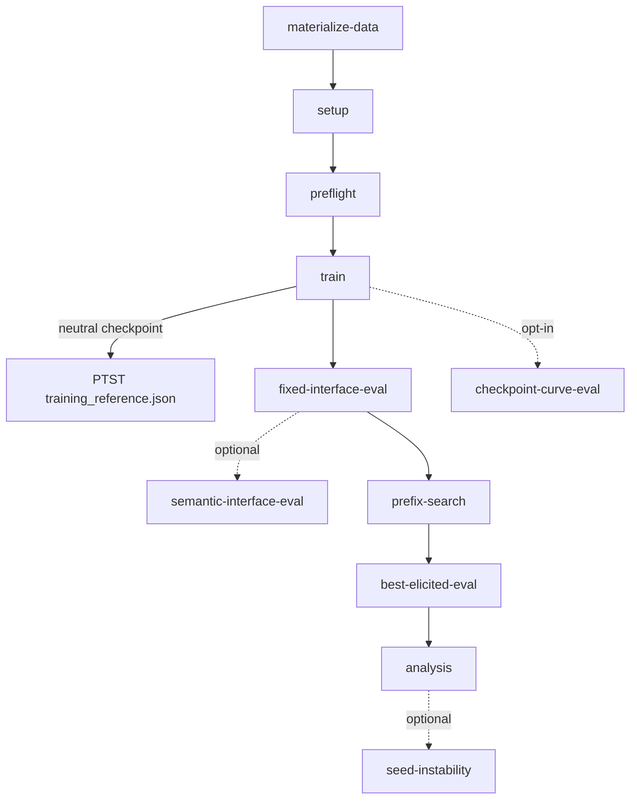

# GCD Sycophancy Pipeline — Architecture (Pre-Refactor)

This document describes the **current** training and evaluation pipeline for
the Gemma GCD sycophancy preregistration as of this commit. It documents what
**is**, not what should be. All paths are relative to
`gcd_sycophancy/projects/` unless otherwise noted.

## 1. Entry points

| Script | Purpose (one line) |
| --- | --- |
| `gemma_gcd/scripts/run_preregistration.py` | Monolithic 11-phase orchestrator for a single prereg experiment directory; CLI dispatches to one phase or `full`. |
| `gemma_gcd/scripts/run_prereg_prompt_panel.py` | Per-candidate panel orchestrator; iterates an eligible-panel JSON and invokes `run_preregistration.py` once per inoculation-prompt candidate in its own experiment dir. |
| `gemma_gcd/scripts/run_ip_sweep.py` | Data materialization plus IP-sweep helpers; provides `materialize_prereg_training_arms` (line 492) and `_prepend_instruction_to_rows` (line 316) used by Arm 2 IP injection. |
| `gemma_gcd/scripts/select_inoculation_prompt.py` | Base-model elicitation screen for **prepend** IP candidates; emits the eligible-panel JSON consumed by the panel orchestrator. |
| `gemma_gcd/scripts/select_inoculation_prompt_append.py` | Sibling of the above for the **append** placement variant; same structure with `append_suffix_to_rows` (line 245) instead of prepend. |
| `multi_seed_run.py` | Per-seed training launcher: `make_multi_seed_configs` (line 12) writes per-seed config dirs, `multi_seed_run` (line 43) shells out to the training script for each seed. |
| `gemma_gcd/main.py` | The actual training entry point invoked by `multi_seed_run.py`; runs SFT, evaluation hooks, and checkpoint saves for one seed. |

## 2. The 11 phases of `run_preregistration.py`

Phase registry: `PHASE_REGISTRY` at `scripts/run_preregistration.py:2194-2208`.
Runners are dispatched via `_PHASE_RUNNERS` (line 2212). Phases marked
**(in_full)** are executed when the user runs `full` (the default).

| # | Phase (CLI subcommand) | One-line | Reads | Writes |
|---|---|---|---|---|
| 1 | `materialize-data` | Validate and freeze the source data manifest; ensure deviations log exists. | `--data-dir/prereg_data_manifest.json`, materialized arm JSONLs under `data/prereg/arms/` | `<experiment_dir>/manifests/prereg_data_manifest.json`, `deviations.jsonl` |
| 2 | `setup` **(in_full)** | Copy template config, materialize all arms via `materialize_prereg_training_arms`, freeze the training manifest, and create per-arm/per-seed condition dirs. | template config, base finetune config, arm specs (`arms_for_arm_set`) | `<experiment_dir>/config.json`, `arms/`, `manifests/training_manifest.json`, `attributes_to_vary.json`, `condition_labels.json`, per-`<condition>/seed_<n>/config.json` |
| 3 | `preflight` **(in_full)** | Confirmatory pilot: run training+eval on a small seed/limit subset and gate on exclusion / parseability / final-loss thresholds. | frozen manifests, per-arm seed configs | `reports/preflight_*.json`, `reports/preflight_summary.md` |
| 4 | `train` **(in_full)** | Run multi-seed SFT for every selected arm; gate via `_check_training_convergence` (line 893); emit PTST training-reuse pointer to neutral checkpoint. | per-`<condition>/seed_<n>/config.json`, materialized arm JSONLs | per-`<condition>/seed_<n>/results/<timestamp>/` (model dir, `results.json` with `train_losses`), PTST `training_reference.json` |
| 5 | `fixed-interface-eval` **(in_full)** | Evaluate trained models on the canonical fixed-interface (verdict-tag) prompt; write the baseline formatting-failure-rate report and gate prefix-search eligibility. | trained model dirs | per-`<condition>/seed_<n>/<eval_output_subdir|fixed_interface>/`, `reports/fixed_interface_baseline.json` |
| 6 | `semantic-interface-eval` | Evaluate trained models on the looser semantic-interface prompt (parallel to fixed-interface). | trained model dirs | per-`<condition>/seed_<n>/semantic_interface/` |
| 7 | `prefix-search` **(in_full)** | Search for the bounded elicitation prefix that maximizes sycophancy per (arm, seed); freeze the selected prefix artifact. | trained model dirs, fixed-interface baseline report | per-`<condition>/seed_<n>/prefix_search/`, frozen `selected_prefix.json` |
| 8 | `best-elicited-eval` **(in_full)** | Re-evaluate trained models using the frozen best-elicited prefix per (arm, seed). | frozen `selected_prefix.json`, trained model dirs | per-`<condition>/seed_<n>/best_elicited/` |
| 9 | `analysis` **(in_full)** | Run the canonical preregistered analysis (H1–H5), exclusion diagnostics, and the final report. | all per-(arm, seed) eval outputs, deviations log | `analysis/*.json`, `analysis/exclusion_*`, `reports/final_report.md`, problem-level export CSV |
| 10 | `seed-instability` | Per-arm seed-stability diagnostics (variance across seeds for matched conditions). | per-(arm, seed) eval outputs | `seed_instability/*.json`, `seed_instability/report.md` |
| 11 | `checkpoint-curve-eval` | Evaluate every saved step-checkpoint to produce a behavioral curve (opt-in via `--checkpoint-curve-every-steps`). | step-checkpoint dirs under each seed | per-`<condition>/seed_<n>/checkpoint_curve/` |

Two CLI-only pseudo-phases also live in the registry: `full` (run every
`in_full=True` phase in registry order) and `record-deviation` (append a
deviation entry to `deviations.jsonl`).

## 3. Phase ordering



`full` executes A → B → C → D → E → G → H → I (the `in_full=True` set).
`semantic-interface-eval`, `seed-instability`, and `checkpoint-curve-eval` are
opt-in. The PTST arm does not train; instead its `seed_<n>/` directory gets a
`training_reference.json` written by `_write_ptst_training_reference`
(`scripts/run_preregistration.py:818`) pointing at the matching neutral seed
dir. The convergence gate `_check_training_convergence` runs at the **end** of
`run_training_phase` (`scripts/run_preregistration.py:990-992`) and skips PTST.

## 4. Data flow on disk

The canonical layout under `<experiment_dir>/`:

```
<experiment_dir>/
  config.json                        # template config copied during setup
  arms/                              # per-arm materialized rows + per-arm meta
    training_manifest.json           # source manifest copied here by materialize_prereg_training_arms
    <arm_slug>/                      # one per arm (e.g. neutral_baseline, inoculation_prompting, ptst, ...)
      train.jsonl                    # IP-prepended for the inoculation_prompting arm
      dev.jsonl
      ...
  manifests/
    prereg_data_manifest.json        # frozen copy of source data manifest
    training_manifest.json           # frozen copy of arms/training_manifest.json
    run_manifest.json                # phase-completion ledger (one entry per recorded phase)
  attributes_to_vary.json            # condition specs consumed by setup_condition_dirs
  condition_labels.json              # slug -> human-readable label
  deviations.jsonl                   # append-only deviation log
  dataset_path-inoculation_ipb_train_eval_user_suffix-/  # one condition dir per arm
    seed_0/
      config.json                    # per-seed training config (written by setup)
      results/
        <timestamp>/
          results.json               # train_losses, eval metrics
          model/                     # trained checkpoint
      fixed_interface/               # phase 5 outputs (or <eval_output_subdir>)
      semantic_interface/            # phase 6 (optional)
      prefix_search/                 # phase 7
      selected_prefix.json           # phase 7 frozen artifact
      best_elicited/                 # phase 8
      checkpoint_curve/              # phase 11 (opt-in)
    seed_1/ ...
  reports/
    preflight_*.json, preflight_summary.md         # phase 3
    fixed_interface_baseline.json                  # phase 5 gate input
    final_report.md                                # phase 9
  analysis/
    *.json, exclusion_*, problem_level_export.csv  # phase 9
  seed_instability/                                # phase 10
```

Phase-N → phase-(N+1) hand-off: each phase's recorded outputs (via
`_record_phase`, line 335) are looked up by the next phase through the file
paths above. For example, `prefix-search` writes
`seed_<n>/selected_prefix.json` which `best-elicited-eval` reads to pick the
prefix to elicit with; `fixed-interface-eval` writes
`reports/fixed_interface_baseline.json` which `prefix-search` reads via
`_prefix_search_gate_status` (line 1169).

The panel orchestrator parallels this: each candidate gets a sibling
`<experiment_root>/<corpus_b_variant>/<sanitized_candidate_id>/` directory with
the same internal layout, and the root carries one `prompt_panel_manifest.json`
covering all candidates (`scripts/run_prereg_prompt_panel.py:51, 226`).

## 5. Shared state

**`RunnerConfig`** dataclass — `scripts/run_preregistration.py:84-119`. Frozen
configuration object passed by value to every phase runner. Carries the
experiment dir, template config path, data dir, seed tuple, LLM-backend
selection, formatting/exclusion gate thresholds, corpus-B variant, optional
checkpoint-curve settings, the resolved IP instruction + ID, the arm set,
optional `only_arms` filter, prompt-template variant, and an optional
`eval_output_subdir`.

Canonical manifest files (all under `<experiment_dir>/manifests/` unless
noted):

- **`run_manifest.json`** — phase-completion ledger; `_record_phase`
  (`run_preregistration.py:335`) appends one entry per recorded phase with
  outputs.
- **`training_manifest.json`** — frozen per-experiment copy of the source
  `data/prereg/arms/training_manifest.json` written by
  `_freeze_training_manifest` (`run_preregistration.py:595`); validated by
  `_validate_training_manifest` (line 576).
- **`prereg_data_manifest.json`** — frozen copy of the source data manifest
  validated by `_validate_and_freeze_data_manifest` (line 373).
- **`prompt_panel_manifest.json`** — written at `<experiment_root>/` by the
  panel orchestrator (`run_prereg_prompt_panel.py:51, 154`); records the
  source eligible panel, corpus-B variant, seeds, phases, and per-candidate
  experiment directories.

## 6. Cross-cutting concerns

- **IP placement.** The Arm 2 inoculation instruction is prepended to Corpus B
  user messages by `_prepend_instruction_to_rows` at
  `scripts/run_ip_sweep.py:316-326`. Append-placement experiments use the
  parallel `append_suffix_to_rows` in
  `scripts/select_inoculation_prompt_append.py:245`. The chosen instruction is
  threaded through `RunnerConfig.ip_instruction` / `ip_instruction_id` and
  applied during `setup` (`run_preregistration.py:716-717`), so every
  downstream phase trains/evaluates against the same prepended text.
- **Convergence gate.** `_check_training_convergence`
  (`scripts/run_preregistration.py:893-946`) runs at the end of the `train`
  phase. It reads each `seed_<n>/results/<latest>/results.json`, compares
  `train_losses[-1]` against `RunnerConfig.preflight_max_final_train_loss`,
  skips the PTST arm (which reuses the neutral checkpoint), and raises if any
  selected (arm, seed) failed to converge.
- **ROCm visible-device convention.** When launching training on AMD GPUs, the
  caller masks devices with `ROCR_VISIBLE_DEVICES=<physical-id>` and always
  sets `HIP_VISIBLE_DEVICES=0` / `CUDA_VISIBLE_DEVICES=0` because the masked
  device is renumbered to logical index 0. This is enforced by the launcher
  scripts (e.g. `followups/run_contrastive_pairs_b2_semantic_eval_gpu0.sh`),
  not by `run_preregistration.py` itself.
